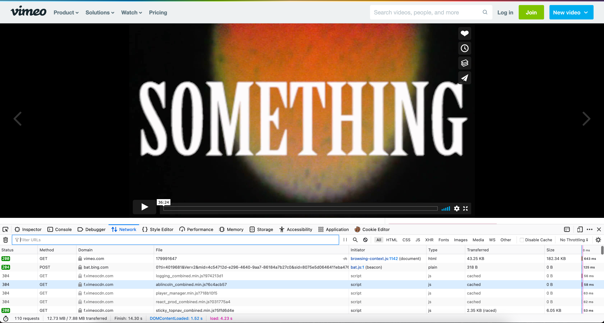
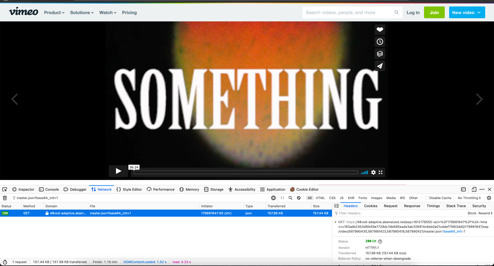
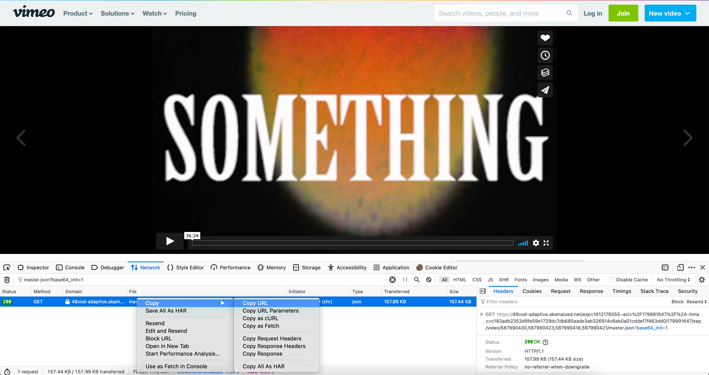

[](https://lgtm.com/projects/g/MitsukiGoto/DownloadVimeo/context:cpp)
[](LICENSE)
### Thanks to
https://github.com/tplgy/cppcodec \
https://github.com/eMBee/vimeo-download
### Features
This enables you to download videos hosted by vimeo which cannot download by youtube-dl.
### Installation
Download bainary that fits your OS. \
Latest Release here: \
Ubuntu:
https://github.com/MitsukiGoto/DownloadVimeo/releases/tag/v1.10 \
Mac:
https://github.com/MitsukiGoto/DownloadVimeo/releases/tag/mac-v1.10
### Usage
This requires an unusual link like "http://...master.json?base64_init=1" \
To get this url:
1. Open the network tab in the inspector

2. Filter the url like this.

3. Right click and copy the link.


After you get that url, run the commmand 
```
./vimeo_download --url [that url] --output [video's name]
```
### Build yourself
<details>
<summary>How to build</summary>

### Requirement
libcurl, boost.program_options, ffmpeg
### Installation
**For macOS Users**
1. If your Mac is not installed required library, please run the following command.
```
brew install ffmpeg
brew install boost
``` 
2.  Run the following command to build.
```
mkdir build
cd build
cmake ../vimeo_download
cmake --build ./
```
**For Ubuntu Users**
1. If your PC is not installed required library, please run the following command.
```
sudo apt install libboost-dev
sudo apt install libboost-all-dev
sudo apt install libcurl4-openssl-dev
sudo apt install ffmpeg
``` 
2.  Run the following command to build.
```
mkdir build
cd build
cmake ../vimeo_download
cmake --build ./
```
**For Ubuntu on WSL2 Users** \
Follow the instructions given above. \
**For Other Linux or Pure Windows Users** \
Sorry, this project is not supporting these platforms now. \
But this is going to come soon!!!!
</details>
